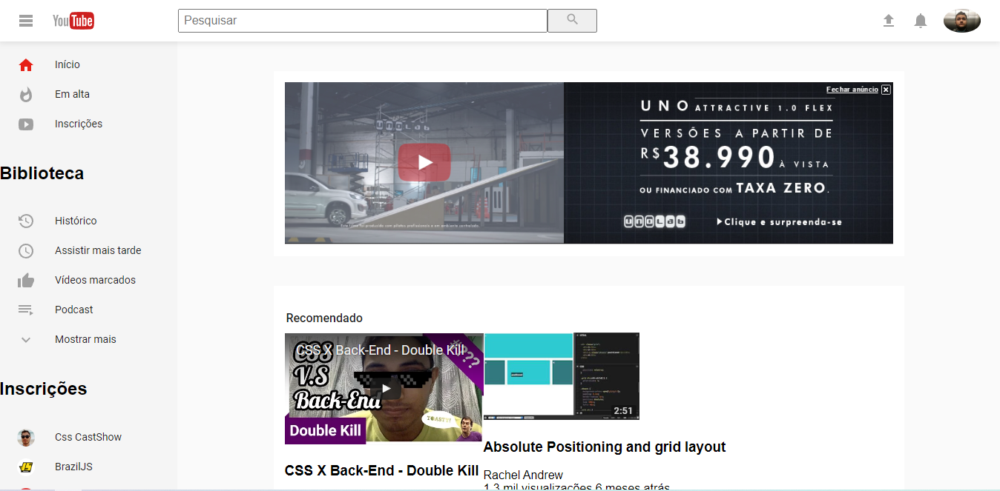

 👨‍💻 Desafio de Projeto CSS: Clone do YouTube com Layout CSS Grid

 Este é um projeto simples que replica a página inicial do YouTube usando HTML e CSS, com foco em CSS Grid Layout

 ## 💻 Tecnologias usadas:
- HTML5
- CSS3

## 🖥 Preview:
)

Venha ver como ficou o projeto acessando [aqui](https://gbarros013.github.io/ListaYoutube/).

## ⚙ Execução do projeto:
1. Clonar o Repositório: Basta utilizar o comando `git clone` para clonar este projeto e salvá-lo em sua máquina. Em seguida, execute o arquivo `index.html`.

## 🤔 O que foi feito neste projeto:
Este projeto replica o layout da página inicial do YouTube, incluindo o cabeçalho, navegação na barra lateral, vídeos recomendados e recomendações de transmissões ao vivo. Ele utiliza o CSS Grid Layout e segue os princípios do Atomic Design para estruturar os componentes e estilos. O projeto utiliza o Normalize.css para estilos consistentes e Google Fonts para melhorar a tipografia.

O layout é responsivo e projetado para funcionar bem em diferentes tamanhos de tela.

2. GitHub Pages: Você também pode acessar o projeto [neste link](https://gbarros013.github.io/ListaYoutube/), que abrirá o projeto no GitHub Pages, sem precisar baixar o repositório em sua máquina.
